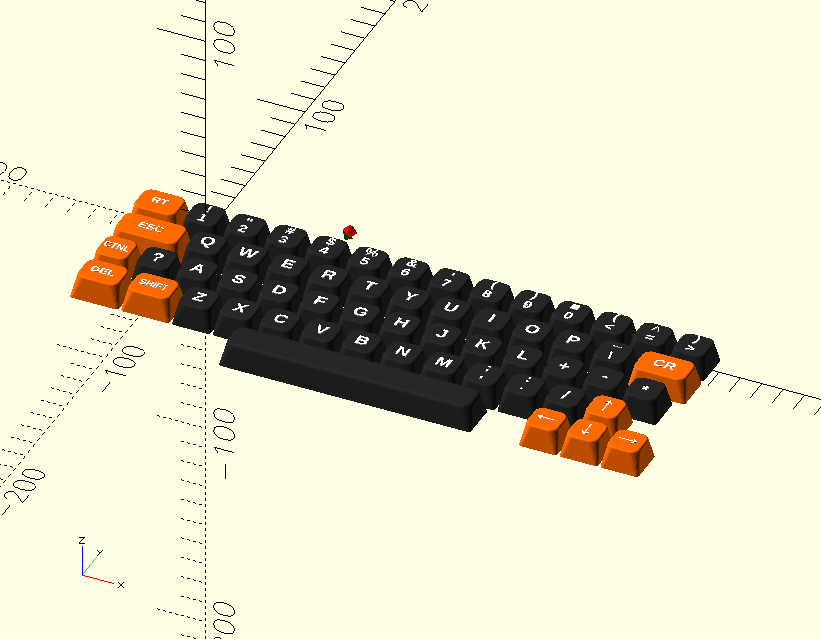
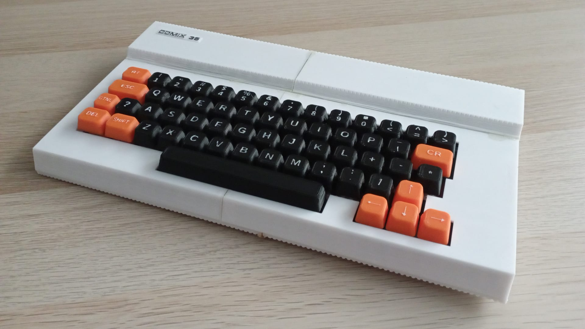

# comix35
This repository contains projects for Comix35

## comixino
[SW and HW](https://github.com/issalig/comix35/tree/main/comixino) for loading (and saving in the future) data/programs without the need of another computer. It is basically a mix of the HSDC and TZXDuino.

### SW
Comixino [software](https://github.com/issalig/comix35/tree/main/comixino/sw) is basically and adaption of TZXDuino for the COMIX-35. However, communication is not cassette-based but serial is used.
By pressing up/down buttons it is possible to navigate through the file system. Then, pressing PLAY will transmit the file to the COMIX-35. Please remember to type "PLOAD" in the COMIX-35 before pressing PLAY.
Recording is done similarly. First press RECORD button on comixino, then type "PSAVE" in COMIX-35. However, "record" function does not work correctly as it misses some bytes. If you can help me, please do it.

It is possible to use hardware serial or software serial (comment/uncomment #define SW_SERIAL 1)

### HW
Comixino [board](https://github.com/issalig/comix35/tree/main/comixino/hw) is made up of an Arduino Uno, OLED screen, and SD card reader and connects to the expansion port. However, it just uses 3 connections /EF4, Q and GND.
A pass-trough connection is also available allowing to experiment with the bus signals.

## Keycaps
[Keycaps](https://github.com/issalig/comix35/tree/main/keycaps) for the Comix35 clone (https://github.com/schlae/comix-35)

## Case
Modified [case](https://github.com/issalig/comix35/tree/main/case) based in https://www.thingiverse.com/thing:5405097 with hole for cartridges and left aligned keys. Suitable for printing in small/standard 3d printers.

