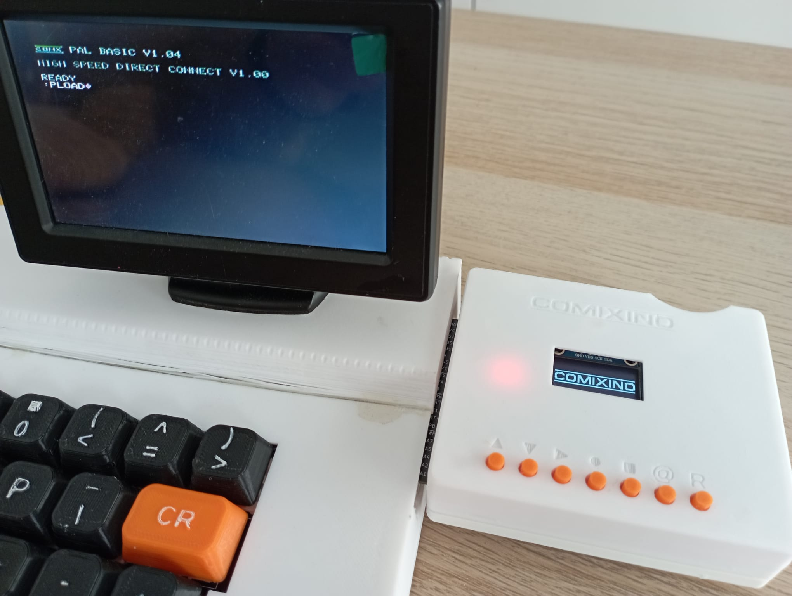

# COMIXINO - COMX File Player/Recorder

## Overview
COMIXINO is an Arduino-based project that plays and records COMX files using High Speed Direct Connection (HDSC). It's designed to work with the COMX-35 computer system, allowing you to transfer programs and data between a modern SD card storage and the vintage computer.

You will need to flash the corresponding ROM to your COMX-35/COMiX-35 from https://github.com/etxmato/COMiX-HighSpeedDirectConnect/tree/main/roms (thanks a lot etxmato!!!) This rom provides an special version of PLOAD/PSAVE commands.

## Case
[3D printing files](case)
## HW
[PCB and gerbers](hw)
## SW
[Code for Comixino](sw)
