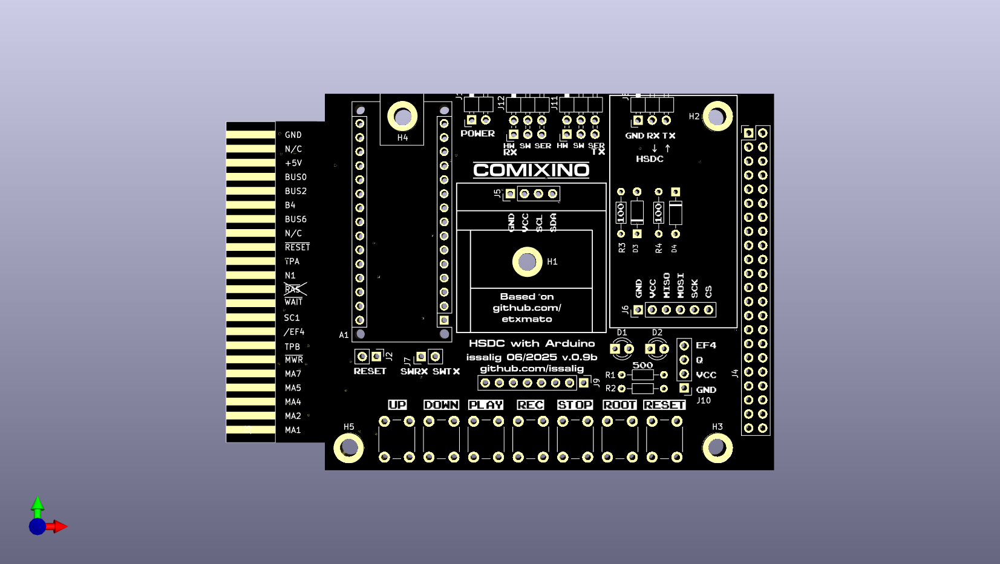

# COMIXINO - COMX File Player/Recorder

## Overview
COMIXINO is an Arduino-based project that plays and records COMX files using High Speed Direct Connection (HDSC). It's designed to work with the COMX-35 computer system, allowing you to transfer programs and data between a modern SD card storage and the vintage computer.

## Hardware configuration
There are some jumpers that need to be configured.
 - J1: Powers Arduino from COMX-35. If Comixino is connected to the PC through USB it would be better not to have the jumper but it is proven to work. (Necessary)
 - J2: If connected it resets both Comixino and COMX-35 when reset button is pressed. (Recommended)
 - J11: TX. Set to HW (hardware serial) as default option. Set it to SW (software serial) if you compiled it ```#define SW_SERIAL 1 ``` (Recommended HW)
- J12: RX. Set to HW (hardware serial) as default option. Set it to SW (software serial) if you compiled it ```#define SW_SERIAL 1 ``` (Recommended HW)
 - J8: Original connector from HSDC board that plugs to an RS232-USB converter.
 - J7: Exposed pins for software serial TX/RX (not necessary)


